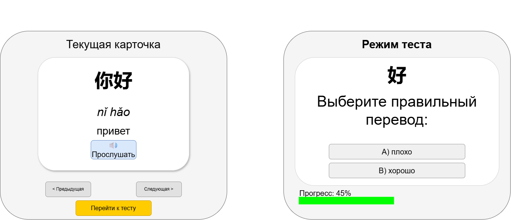

# Chinese Character Widget

An embeddable Web Component for learning Chinese characters (Hanzi). Supports flashcard study mode, configurable multiple-choice quizzes, audio pronunciation via the Web Speech API, and per-instance progress tracking stored in `localStorage`.



## Features

- **Flashcard mode** — browse characters with pinyin, translation, and example sentences
- **Audio playback** — hear correct pronunciation using the browser's Speech Synthesis API (zh-CN)
- **Quiz mode** — configurable multiple-choice tests (choose question type, answer type, and question count)
- **Progress tracking** — learned-character toggle and cumulative score saved per widget instance in `localStorage`
- **Stats view** — see how many characters you've marked as learned with a visual progress bar
- **Internationalization** — all UI strings loaded from an external `i18n.json` file
- **Multiple instances** — run several independent widgets on one page, each with its own card set and state
- **Shadow DOM** — styles are fully encapsulated; the widget won't clash with host-page CSS

## Usage

### 1. Include the widget script

```html
<script src="widget/app.js"></script>
```

### 2. Add the custom element

```html
<chinese-widget
  id="my-widget"
  data-cards="widget/cards.json"
  data-i18n="widget/i18n.json"
></chinese-widget>
```

### Attributes

| Attribute        | Default              | Description                                      |
|------------------|----------------------|--------------------------------------------------|
| `data-cards`     | `widget/cards.json`  | Path to the JSON file with character cards       |
| `data-i18n`      | `widget/i18n.json`   | Path to the JSON file with UI translations       |
| `data-css`       | `widget/app.css`     | Path to the widget stylesheet                    |
| `data-start-card`| `0`                  | Index of the card to show on first load          |
| `data-audio`     | `true`               | Set to `"false"` to disable audio playback       |

## Card format (`cards.json`)

```json
[
  {
    "char": "你",
    "pinyin": "nǐ",
    "translation": "You",
    "example": "你好！",
    "exTranslation": "Hello!"
  }
]
```

## i18n format (`i18n.json`)

All button labels, section headings, and icon characters live in `i18n.json`. Swap this file to translate the UI into any language.

## Project structure

```
├── index.html          # Demo page
├── app.js              # Demo page bootstrap (dynamically builds the page)
├── style.css           # Demo page styles
├── data.json           # Demo page content (title, description, user stories)
├── widget.png          # Widget sketch/preview image
└── widget/
    ├── app.js          # Web Component source (<chinese-widget>)
    ├── app.css         # Widget styles (loaded into Shadow DOM)
    ├── i18n.json       # UI strings
    ├── cards.json      # HSK1 sample card set
    ├── hsk2_cards.json # HSK2 sample card set
    └── hsk3_cards.json # HSK3 sample card set
```

## Browser support

Any modern browser with support for Custom Elements v1, Shadow DOM v1, and the Web Speech API (Chrome, Edge, Safari, Firefox 63+).

## License

MIT
